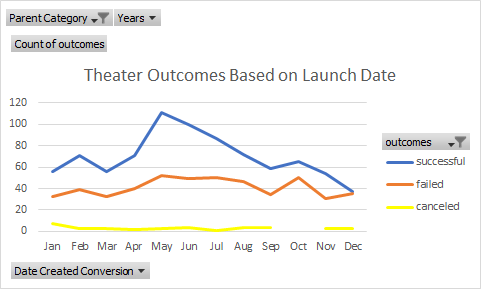
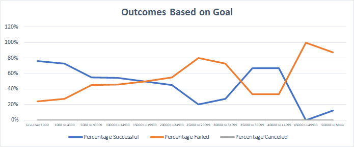

# Kickstarting with Excel

## Overview of Project

To know how different campaigns fared in relation to their launch dates and their funding goals.

### Purpose

## Analysis and Challenges

### Analysis of Outcomes Based on Launch Date

### Analysis of Outcomes Based on Goals

### Challenges and Difficulties Encountered

## Results
- What are two conclusions you can draw about the Outcomes based on Launch Date?

Upon visual inspection of Theater Outcomes vs Launch Dates (image 1) we can see that for the catagory of theater that May was the most successful month for kickstarter launches (111 successful launches). May was followed by June (100) and July (87). 

During the months of October, November and December we see a steady decline in the success rate of launches. That downward trends reaches a point in December where we see a 50% success/fail rate during that month.
   
image 1

- What can you conclude about the Outcomes based on Goals?

The rate of success was higher for campaigns with a funding goal of less than $5,000 (image 2). Campaigns with a funding goal of less than a $1,000 up to $4,999 had a success rate ranging from 73% to 76%.

image 2

- What are some limitations of this dataset?

For Theater Outcomes vs Launch date the data used was from the Parent catagory 'Theater' which includes subcatagories musicals, plays and spaces. All three are different, but particularily spaces. Spaces are the infrastructure for the theater (remodeling,purchase of, building new). With the inclusion of spaces, I think the data was limited from giving a truer picture.

Another limitiation of the dataset is that we don't know how the theater kickstarter campaigns recieved their funding. Did it comes from investors inside the theater community, outside the community, clooections from other theater events, or from outside media efforts. It would have been good to have looked at this data also. Where did the funding 

- What are some other possible tables and/or graphs that we could create?
