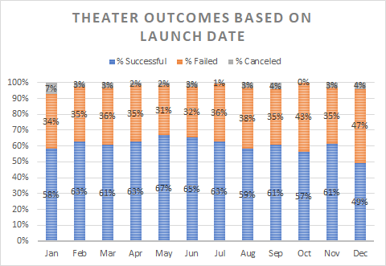

# Kickstarting with Excel

## Overview of Project

The client, Louise, whose play, 'Fever' came close to its fundraising goal in a short amount of time, now wants to know how different campaigns fared in relation to their launch dates and their funding goals.

### Purpose

The purpose of this analysis is to is to compare the results of kickstarter fundraising campaigns based on their launch dates and their funding goals. Specifically looked at were trends in the 'theater' catagory and its subcatagory 'plays' to determine the successful, failed, and cancelled kickstarter campaigns.

## Analysis and Challenges

### Analysis of Outcomes Based on Launch Date

I used a pivot table to filter the data for the category ‘theater’ which includes subcatagories; 'musicals', 'plays' and 'spaces'. I then combined the years so monthly data could be viewed in a condensed format. This allowed a view of the data seasonally and for any potential trends between the successful, failed, or cancelled kickstarter launches in the theater catagory.

### Analysis of Outcomes Based on Goals

For this goal based analysis, the number of successful, failed, and canceled campaigns based on fundraising goal was analyzed. With the exception of the first range (<$1000) and the last range (>$50000) all other ranges were in dollar ranges of $5000. Only fundrasing goals for the subcategory 'plays' was used. This information was then plotted in a line graph to show how the percent of successes and failures changed as the fundraising goal amount increased.

### Challenges and Difficulties Encountered

The one big challenge I faced was creating the table for Outcomes Based on Goals table. This table needed dollar amont ranges. When creating the dollar amount ranges with the Excel formula 'Countifs' the formula needed heavy editing. I did not realize when referencing the columns for the dollar amount ranges, you needed to put the '$' in front of those referenced columns in order for the formula to capture those dollar amount ranges.

## Results
- Two conclusions drawn about the Outcomes based on Launch Date

Upon visual inspection of Theater Outcomes vs Launch Dates (image 1 Theater Outcomes vs Launch Date) we can see that for the catagory of theater that May was the most successful month for kickstarter launches (111 successful launches). May was followed by June (100) and July (87) for successful launches. 

During the months of October, November and December we see a steady decline in the success rate of launches. That downward trends reaches a point in December where there is 50% success/fail rate during that month.
   
image 1 Theater Outcomes vs Launch Date

- Conclusions about the Outcomes based on Goals

The rate of success was higher for campaigns with a funding goal of less than $5,000 (image 2 Outcome vs Goals). Campaigns with a funding goal of less than a $1,000 saw nearly an 80% chance of being successful. For fundraising goals in the $1000-$4,999 the success rate range was still in the mid seventies. As one might expect, the higher the goal for fundrising, the lower the percentage of successful campaigns. The exception to this was in the ranges of $35,000- $44,999 range where the success rate was 67%. However, once above the $45,000 amount, the success rate plumeted to a 100% failure rate.

image 2 Outcome vs Goals

- What are some limitations of this dataset?

For Theater Outcomes vs Launch date the data used was from the Parent catagory 'Theater' which includes subcatagories musicals, plays and spaces. All three catagories are different, but particularily spaces. Spaces are the infrastructure for the theater (remodeling, purchase of, building new). With the inclusion of spaces, I think the data was limited from giving a truer analysis.

With the current data, we know when the most successful theater kickstarters were launched and we know what the most successful fundraising goals were for campaigns. I believe it would be important to know the source of funding for successful kickstart campaigns. Did it comes from investors inside the theater community, outside the community, collections from participants at other theater events, from outside media efforts or other? It would have been good to have looked at this data also in conjunction with fundraising launch dates and goal amounts.

- What are some other possible tables and/or graphs that we could create?

In looking at Theater Outcomes vs Launch Date we were looking at just sheer numbers per month (Number of launches successful vs failed). The month of May did have the most successful fundraing campaigns, but it also had the most failed campaigns. May did have the most launched campaigns of any month, so it's not surprising to find it had the most failed and successful campaigns. A look at the percent of successful vs failed campaigns analysis wold be insightful (image 3 Theater Outcomes vs Launch Date Percentage Bar). In terms of percentage of successful plays vs failed plays, the month of May (67% successful) was only a few percent above June (65%) and April and July (64%).

image 3 Theater Outcomes vs Launch Date Percentage Bar

